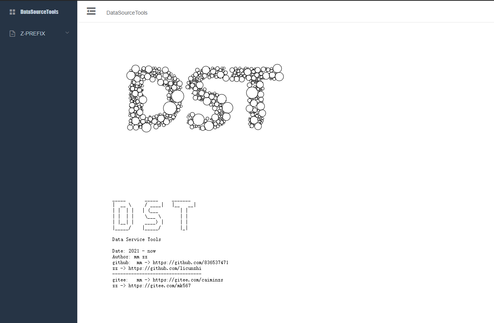
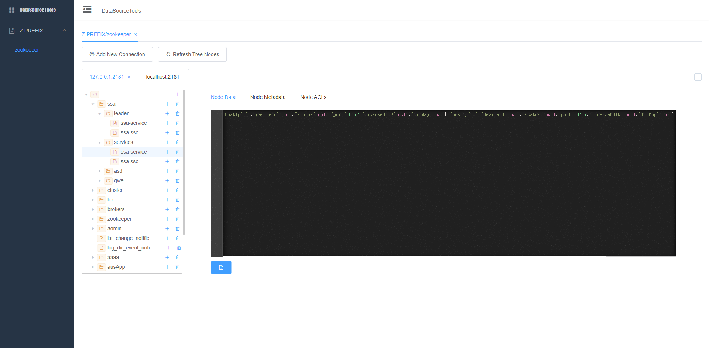

# DST

#### 介绍
Data Show Tools

#### 软件架构
软件架构说明

#### 安装教程

1. 双击执行 `DST.exe`文件

#### 使用说明

1.  双击执行 `DST.exe`文件

#### 现有功能
- Z-PREFIX
    - [x] zookeeper
    
#### 系统截图
- 首页

- zookeeper
    - 主页
    

#### 参与贡献

1.  Fork 本仓库
2.  新建 Feat_xxx 分支
3.  提交代码
4.  新建 Pull Request

#### 作者信息
- [caimin](https://github.com/836537471)
- [licunzhi](https://github.com/licunzhi)
